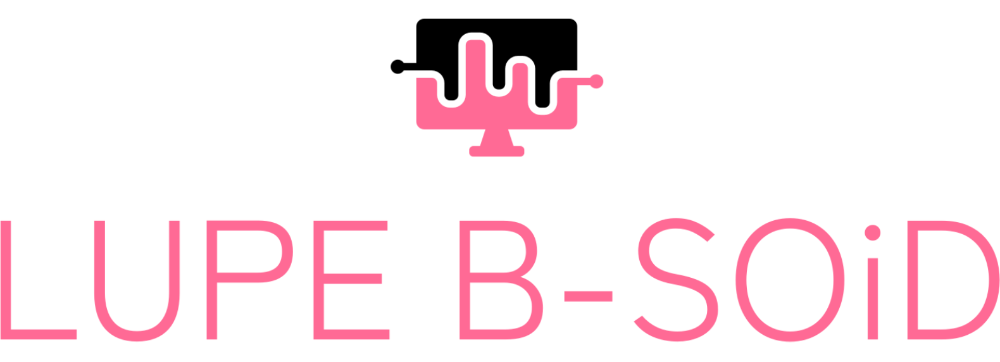

### Project funding
Collaboration between Corder Lab at University of Pennsylvania and 
Yttri Lab from Carnegie Mellon. 
Alex Hsu actively develops and maintains this repository/cloud resource.

### Website
Thanks to Streamlit Community Cloud,
we are able to bring mobile data analytics to life!
Visit the cloud app at 
[lupe x bsoid cloud app](https://runninghsus-lupe-bsoid-cloud-main-c1vlv3.streamlit.app/)

### LICENSE
LUPE X B-SOiD is released under a 
[Clear BSD License](https://github.com/runninghsus/lupe-bsoid-cloud/blob/main/LICENSE) 
and is intended for research/academic use only.

---